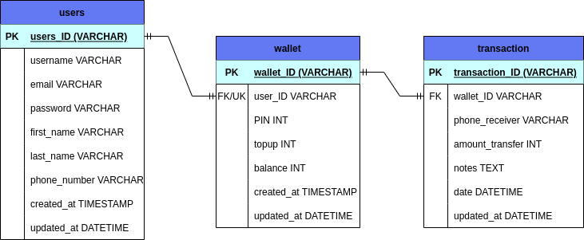

# API Specification

## Registration

Request :

- Method : POST
- Endpoint : `/api/users/registration`
- Header :
  - Content-Type: application/json
  - Accept: application/json
- Body :

```json
{
  "username": "string",
  "email": "string",
  "password": "string"
}
```

Response :

```json
{
  "status": "string",
  "code": "number",
  "data": {
    "id": "string",
    "username": "string",
    "email": "string",
    "password": "string"
  },
  "message": "Registration success!"
}
```

## Login

Request :

- Method : POST
- Endpoint : `/api/users/login`
- Header :
  - Content-Type: application/json
  - Accept: application/json
- Body :

```json
{
  "email": "string",
  "password": "string"
}
```

Response :

```json
{
  "status": "string",
  "code": "number",
  "data": {
    "id": "string",
    "username": "string",
    "email": "string",
    "password": "string",
    "first_name": "string",
    "last_name": "string",
    "phone": "character"
  },
  "message": "Login success!"
}
```

## List Users

Request :

- Method : GET
- Endpoint : `/api/users`
- Header :
  - Accept: application/json
  - Auth: admin
- Query Param :
  - sort : string,
  - order : string
- Pagination :
  - currentPage: integer,
  - limit: integer,
  - totalUser: integer,
  - totalPage: integer

Response :

```json
{
  "status": "string",
  "code": "number",
  "data": [
    {
      "id": "string, unique",
      "username": "string",
      "email": "string",
      "password": "string",
      "first_name": "string",
      "last_name": "string",
      "phone": "character",
      "createdAt": "date",
      "updatedAt": "date"
    },
    {
      "id": "string, unique",
      "username": "string",
      "email": "string",
      "password": "string",
      "first_name": "string",
      "last_name": "string",
      "phone": "character",
      "createdAt": "date",
      "updatedAt": "date"
    }
  ],
  "message": "Data requests success!",
  "pagination": {
    "currentPage": "integer",
    "limit": "integer",
    "totalAccount": "integer",
    "totalPage": "integer"
  }
}
```

## Create User

Request :

- Method : POST
- Endpoint : `/api/users`
- Header :
  - Content-Type: application/json
  - Accept: application/json
  - Auth: admin
- Body :

```json
{
  "username": "string",
  "email": "string",
  "password": "string",
  "first_name": "string",
  "last_name": "string",
  "phone": "character"
}
```

Response :

```json
{
  "status": "string",
  "code": "number",
  "data": {
    "username": "string",
    "email": "string",
    "password": "string",
    "first_name": "string",
    "last_name": "string",
    "phone": "character"
  },
  "message": "Data requests input success!"
}
```

## Update User

Request :

- Method : PUT
- Endpoint : `/api/users/{id_user}`
- Header :
  - Content-Type: application/json
  - Accept: application/json
- Body :

```json
{
  "username": "string",
  "email": "string",
  "first_name": "string",
  "last_name": "string",
  "phone": "character"
}
```

Response :

```json
{
  "status": "string",
  "code": "number",
  "data": {
    "id": "string",
    "username": "string",
    "email": "string",
    "password": "string",
    "first_name": "string",
    "last_name": "string",
    "phone": "character"
  },
  "message": "Data request update success!"
}
```

## Get Details User

Request :

- Method : GET
- Endpoint : `/api/users/details/{id_user}`
- Header :
  - Accept: application/json

Response :

```json
{
  "status": "string",
  "code": "number",
  "data": {
    "id": "integer, unique",
    "username": "string",
    "email": "string",
    "password": "string",
    "first_name": "string",
    "last_name": "string",
    "phone": "character",
    "createdAt": "timestamp",
    "updatedAt": "datetime"
  },
  "message": "Data request success!"
}
```

## Delete User

Request :

- Method : DELETE
- Endpoint : `/api/users/{id_user}`
- Header :
  - Accept: application/json

Response :

```json
{
  "status": "string",
  "code": "number",
  "message": "Data requests delete success!"
}
```

## Search User

Request :

- Method : GET
- Endpoint : `/api/users/search`
- Header :
  - Accept: application/json
- Query Param :
  - username : string,
  - id : number

Response :

```json
{
  "status": "string",
  "code": "number",
  "data": [
    {
      "id": "integer, unique",
      "username": "string",
      "email": "string",
      "phone": "character"
    },
    {
      "id": "integer, unique",
      "username": "string",
      "email": "string",
      "phone": "character"
    }
  ],
  "message": "Data requests success!"
}
```

## Join Tables

Request :

- Method : GET
- Endpoint : `/api/join/wallet-user-transaction`
- Header :
  - Accept: application/json

Response :

```json
{
  "status": "string",
  "code": "number",
  "data": [
    {
      "id_user": "integer",
      "email": "string",
      "id_wallet_sender": "integer",
      "id_wallet_receiver": "integer",
      "amount_transfer": "integer",
      "notes": "string",
      "date": "datetime"
    },
    {
      "id_user": "integer",
      "email": "string",
      "id_wallet_sender": "integer",
      "id_wallet_receiver": "integer",
      "amount_transfer": "integer",
      "notes": "string",
      "date": "datetime"
    }
  ],
  "message": "Join tables success!"
}
```

## Entity Relationship Diagram

Here is ERD for Zwallet:


